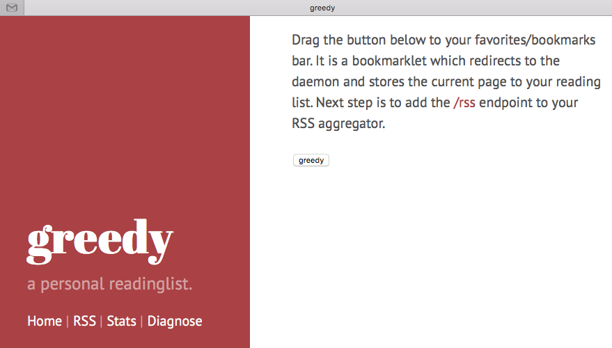
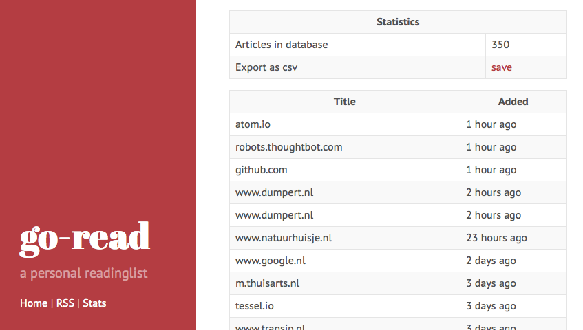

# Greedy
Greedy allows you to run your own collection of `urls to read`. For example: you are reading a webpage and you want to mark it as `read later`, you can use this service to quickly save the page and read it later. From there, the service generates an RSS feed containing all these urls. You can import this RSS feed into your own, favorite RSS client (f.e. [TinyTinyRSS](https://tt-rss.org "TinyTinyRSS")).

# Storage
Greedy uses a local database file (sqlite3) as it's storage. You can specify the location of the database file by setting the `databasefile` environment variable. See environment section below for more information.

# Installation instructions
###### I don't have Go installed
If you don't have a working Go environment, then you can simply download one of the pre-built binaries. For download links, see below. After putting the binary in your path, start the service by running the binary: `./greedy`. By default, it binds to 0.0.0.0:8080, but you can change it's configuration by setting some environment variables which are described below. After starting, the output should be like this:

    INFO[10-18|15:48:03] environment vars                         host=0.0.0.0 port=8080 databasefile=articles.bolt
    INFO[10-18|15:48:03] greedy meta info                         builddate=18-October-2015/15:47:55 commithash=9cb5fe13067f2dead95233e36b3b7b9fd1dd2b73
    INFO[10-18|15:48:03] deamon listening                         host=0.0.0.0 port=8080

###### I have Go installed
If you have Go installed, simply `go get` it:

    go get github.com/rogierlommers/greedy

this will download the sources to your `$gopath`, build a binary and puts it in your Go binary directory. You can leave it there or you can put it in a more convenient place.

###### Usage
Once you have installed and started Greedy, open a browser and point to the `host:port` you have configurated. The greedy homepage should appear. Drag the button to your favorites/bookmarks bar. It is a bookmarklet which redirects to the service and stores the current page to your reading list. Next step is to add the /rss endpoint to your RSS aggregator.

###### Configuration
You can change the default configuration by changing environment vars. For example, running on port 9090 can be done with: `GREEDY_PORT=9090 ./greedy`.

| environment var     | description               | default           |
| --------------------|:-------------------------:| ------------------|
| GREEDY_HOST         | host it binds to          | 0.0.0.0           |
| GREEDY_PORT         | http port                 | 8080              |
| GREEDY_DATABASEFILE | location of database file | ./articles.bolt   |

###### Need help?
For more information, please don't hesitate to contact me [@rogierlommers](https://twitter.com/rogierlommers).

# Running in Docker container
Explained here

# Releases
| version           | download                                                                                                                         |
| ------------------|----------------------------------------------------------------------------------------------------------------------------------|
| 1.0-linux-amd64   | [greedy-1.0-linux-amd64.tar.bz2](https://github.com/rogierlommers/greedy/releases/download/1.0/greedy-1.0-linux-amd64.tar.bz2)   |
| 1.0-linux-368     | [greedy-1.0-linux-368.tar.bz2](https://github.com/rogierlommers/greedy/releases/download/1.0/greedy-1.0-linux-386.tar.bz2)       |
| 1.0-darwin-amd64  | [greedy-1.0-darwin-amd64.tar.bz2](https://github.com/rogierlommers/greedy/releases/download/1.0/greedy-1.0-darwin-amd64.tar.bz2) |
| 1.0-darwin-368    | [greedy-1.0-darwin-386.tar.bz2](https://github.com/rogierlommers/greedy/releases/download/1.0/greedy-1.0-darwin-386.tar.bz2)     |

# History
- 1.0
  - uses BOLT as storage engine
  - display articles as RSS
  - scrapes title and page description
  - single binary containing all (static) files, easy to install
  - multiple platforms: linux and darwin

# Screenshots

