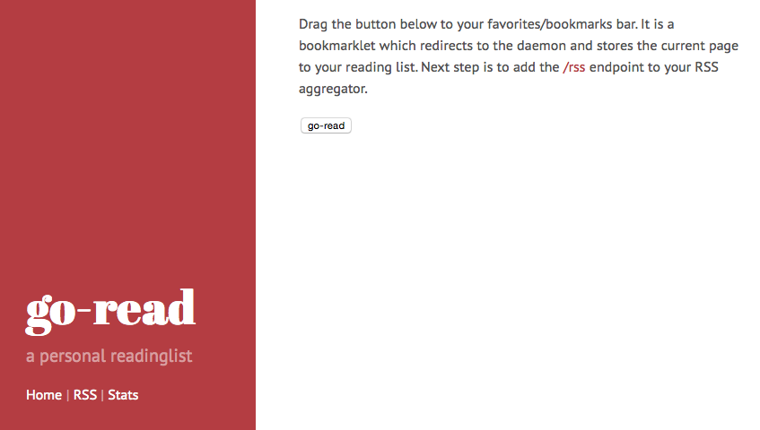

Go-read
===========
Go-read allows you to run your own collection of `urls to read`. For example: you are reading a webpage and you want to mark it as `read later`, you can use this service to quickly save the page and read it later. From there, the service generates an RSS feed containing all these urls. You can import this RSS feed into your own, favorite RSS client (f.e. [TinyTinyRSS](https://tt-rss.org "TinyTinyRSS")).

Storage
============
Go-read uses a local database file (sqlite3) as storage. You can specify the location of the database file by adding the `-databasefile` parameter during startup. By detault, it is stored in the current working directory.

Installation instructions
=========================
Simply install by:

    go get github.com/rogierlommers/go-read

this will download the sources, build a binary and puts it in your Go binary direcory. You can leave it there or you can put it in a more convenient place. I have put it in `/srv/go-read`. You can start the service by running the binary: `./go-read`. By default, it binds to localhost:8080, but you can change this with the `-port` flag. After starting, the output should be like:

    I0629 09:56:47.700995   30466 main.go:38] go-read version: 2015:06:22 20:51:53
    I0629 09:56:47.798813   30466 articles.go:59] does dbfile exist? true
    I0629 09:56:47.799053   30466 main.go:64] running on port 8080
    I0629 09:56:47.799167   30466 articles.go:80] cleanup removed #articles --> 3

Now open a browser and point to `localhost:8080`. The go-read homepage should appear. Drag the button to your favorites/bookmarks bar. It is a bookmarklet which redirects to the service and stores the current page to your reading list. Next step is to add the /rss endpoint to your RSS aggregator.

For more information, please don't hesitate to contact me [@rogierlommers](https://twitter.com/rogierlommers).

Screenshots
=======
204/232 <--> 847/480

